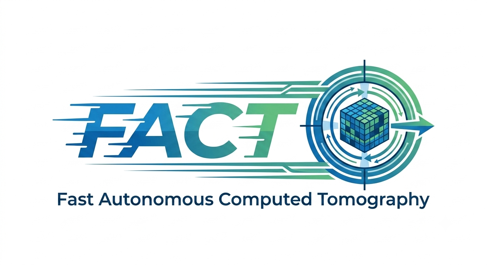

==========
19-BM Docs
==========

|

Manual and operational information for the APS **19-BM Fast
Autonomous Computed Tomography (FACT) beamline** at Argonne
National Laboratory.

19-BM-FACT is a filtered white-beam bending-magnet imaging
beamline in three enclosures (19-BM-A, 19-BM-C, 19-BM-D), focused
on high-throughput, autonomous, micron-resolution X-ray computed
tomography with robotic sample handling. First light in the new
beamline configuration is anticipated during the 2026-3 beam
cycle.

Content
-------

.. toctree::
   :maxdepth: 1

   source/about
   source/manual
   source/ops
   source/procedures
   source/publications

Contribute
----------

* `Documentation <https://github.com/xray-imaging/19bm-docs/tree/master/docs>`_
* `Issue Tracker <https://github.com/xray-imaging/19bm-docs/issues>`_
