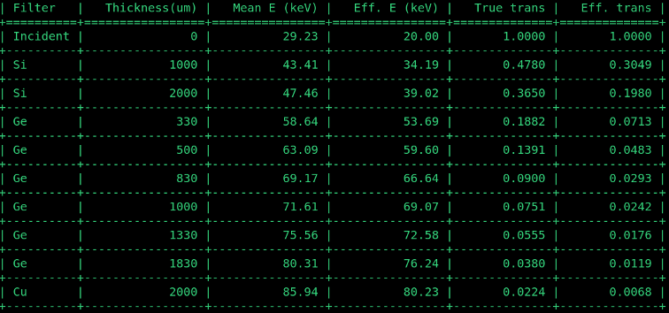

===================
Beamline components
===================

Reference inventory of the physical hardware that makes up the
**19-BM Fast Autonomous Computed Tomography (FACT)** beamline,
walked from the source to the detector. Each component is listed
once, with the fields needed to drive it (Family / role /
intrinsic specs) and the fields needed to reason about how it sits
relative to everything else (what it is mounted on / referenced
to, what rides on top of it). The same structured-block style is
used in the 2-BM beamline reference, so cora's ``Equipment`` BC
can absorb both without a rewrite.

Source of truth for the values below is the **19-BM Final Design
Report** (Alan Kastengren, IMG/XSD, 6 June 2026), referencing
ICMS documents:

- PSS User Requirements — APS_1181415
- BLEPS User Requirements — APS_2388098
- APSU Bending-magnet thermal waiver — APSU_2286907
- APS Engineering Standard, Vacuum Designs — APS_2018473

.. warning::

   **Pre-first-light.** 19-BM-FACT was under construction at the
   time the FDR was written; first light is targeted for the
   2026-3 beam cycle. EPICS PV names below are mostly **TBD**
   until the control system is brought up. Hardware identifiers
   (A359-Mxx / A359-Kxx / K1-20 / F3-30) come from the FDR and
   the APS Component Reference / Ray Trace drawings.

Overview
========

19-BM-FACT runs in **filtered white-beam mode only**, with beam
present in all enclosures whenever the front-end shutter is
open. The beamline accepts **0.8 mrad** of horizontal BM fan
(out of 2.7 mrad available from the M3 magnet, 2.5 mrad
delivered by the front end's first mask). The accepted fan is
referenced to an **alternate centerline 0.4 mrad inboard** of
the default new-BM centerline.

Three enclosures:

====================  ====================================================
Enclosure             Role
====================  ====================================================
**19-BM-A** (FOE)     Front-end optics: exit mask, slits, filters,
                      bremsstrahlung control, gate valve, UHV transport.
**19-BM-C**           Shielded UHV transport only — beam passes through
                      entirely in vacuum, no intercepts.
**19-BM-D**           Endstation. Beryllium window + Kapton window
                      transition to air, sample stage in air, indirect-
                      detection imaging system, beam stops at the
                      downstream wall.
====================  ====================================================

19-BM-C and 19-BM-D share a downstream-wall guillotine that is
held open during operation, so they act as a single shielded
enclosure from a radiation-safety perspective.

Physical walk, source to beam stop (approximate distances, from
the storage-ring source)::

   APS storage ring (BM, M3 magnet)
     -> Front-end exit Be window           (~23 m)
     -> Exit mask A359-M20                 (0.8 mrad horizontal, 0.4 mrad inboard offset)
     -> Bremsstrahlung collimator K1-20    (reused former ID FE collimator)
     -> White-beam slits                   (in 19-BM-A)
     -> F3-30 filter unit                  (Si + Ge filter media)
     -> UHV transport
     -> Gate valve                         (vacuum isolation; isolates 19-BM-A from C/D)
     -> Bremsstrahlung collimator A359-K2  (reused from previous 19-BM)
     -> Shielded UHV transport             (19-BM-A → 19-BM-C)
     -> UHV transport                      (through 19-BM-C, no intercepts)
     -> Water-cooled Be window             (~50 m, beamline-vacuum terminus, 250 µm)
     -> Rough-vacuum section               (protects the Be window from oxidation)
     -> Kapton window                      (transition to air)
     -> [sample + indirect-detection imaging system, in air, 19-BM-D]
     -> Water-cooled Cu photon stop A359-M100  (downstream end of 19-BM-D, water in series with the Be window)
     -> Chevron-brick bremsstrahlung stop A359-K3
     -> Two 12 mm Pb guillotines           (inside the downstream wall of 19-BM-D, APS TB-44 compliance)

Beam delivery
=============

Source
------

:Role: Photon source — APS bending-magnet (M3 magnet).
:Family: Source (BM)
:Maximum delivered fan: 2.7 mrad horizontal (FE first-mask limit
   2.5 mrad)
:Used at 19-BM: **0.8 mrad** horizontal acceptance, referenced
   to an **alternate centerline 0.4 mrad inboard of the default
   new BM centerline** (see CRT and RT drawings).
:Thermal analysis: covered by the APSU thermal waiver for BM
   beamline components (ICMS APSU_2286907) — all 19-BM components
   that intercept synchrotron radiation are water-cooled, so no
   additional thermal analysis is required.

Front-end termination
---------------------

The 19-BM design removes one of the two front-end beryllium
windows at ~23 m from the source (to minimise wavefront-distorting
scatter), and in exchange terminates the beamline vacuum at ~50 m
with a 250 µm beryllium window at the entrance of 19-BM-D
(documented under :ref:`19-bm-d <19-bm-d-endstation>`).

Front-end exit Be window
~~~~~~~~~~~~~~~~~~~~~~~~

:Role: Single front-end Be window through which the white beam
   leaves the FE.
:Family: Window
:Material: Beryllium (FE-standard thickness)
:Position: ~23 m from source
:Cooling: integrated with FE
:Notes: The exit window assembly is bolted rigidly to the first
   exit mask (``A359-M20``, see below) so that the two share a
   common reference and are fiducialised together for survey /
   alignment.

Exit mask — A359-M20
~~~~~~~~~~~~~~~~~~~~

:Role: First in-line aperture; limits the transmitted fan to the
   beamline's 0.8 mrad horizontal acceptance.
:Family: BeamMask
:Drawing: APS sketch **A359-M20**
:Acceptance: 0.8 mrad horizontal (out of 2.5 mrad available from
   the FE)
:Centerline offset: aligned to an alternate centerline 0.4 mrad
   inboard of the default new BM centerline
:Mounted on: bolted to the single FE exit-Be-window assembly
:Cooling: water-cooled (per APSU BM thermal-waiver scope)
:Survey: fiducialised before installation (internal alignment
   reference; cannot be re-aligned in place)
:RSS classification: Radiation-Safety-System (RSS) component;
   PSS-tracked under ICMS APS_1181415

19-BM-A (FOE) components
------------------------

Bremsstrahlung collimator (upstream)
~~~~~~~~~~~~~~~~~~~~~~~~~~~~~~~~~~~~

:Role: First lead bremsstrahlung collimator on the beamline —
   confines secondary bremsstrahlung from upstream apertures /
   FE.
:Family: Collimator (lead)
:Drawing: **K1-20** (reused former ID front-end first collimator)
:Position: 19-BM-A, upstream end, immediately downstream of the
   exit mask
:Material: Pb

White-beam slits
~~~~~~~~~~~~~~~~

:Role: Define the horizontal × vertical beam footprint passed to
   the filter unit and downstream optics; also act as a
   conductance limit, sufficient to maintain vacuum control
   during a breach event downstream.
:Family: Slits
:Position: 19-BM-A, downstream of the upstream bremsstrahlung
   collimator
:Cooling: water-cooled (intercepts white beam; APSU BM thermal-
   waiver scope)
:EPICS prefix: TBD

F3-30 filter unit
~~~~~~~~~~~~~~~~~

:Role: Filter the white beam to the desired spectrum for
   indirect-detection tomography. Selectable combinations of
   silicon, germanium, and copper filter plates modify the
   transmitted spectrum and reduce heat load on downstream
   components.
:Family: Filter (modified F3-30 carriage, reused from 1-ID)
:Position: 19-BM-A, downstream of the white-beam slits
:Materials: Si, Ge, and Cu filter media in two selectable banks
:Cooling: water-cooled
:EPICS prefix: TBD
:Proposed bank arrangement
   (`Alan Kastengren development notes
   <https://anl.box.com/s/t1omsvb59zunqap6y4grc4dbg4skbv4u>`__,
   2026-05-07):

   - **Bank 1:** Open · Si 1000 µm · Ge 330 µm · Ge 830 µm · Cu 2000 µm
   - **Bank 2:** Open · Si 1000 µm · Ge 500 µm · Ge 1000 µm · *(slot 5 TBD)*

   Combining the two banks gives Si 1000, Si 2000, Ge 330, 500,
   830, 1000, 1330, 1830, and Cu 2000 µm equivalent thicknesses.
   There is a deliberate gap between Ge 500 and Ge 830; otherwise
   the spacing covers the full operational spectrum smoothly.

:Notes:
   Filter wafers are 2″ diameter; each wafer yields two usable
   filter pieces. The outer vertical dimension of the F3-30
   frame that covers the filter is **23 mm**, which sets the
   maximum cut height for the APS crystal-shop work request.
   Water plumbing is the original 1-ID arrangement.

   Calculated mean energy, effective energy, and transmission
   (true and effective) at the design incident spectrum (mean
   E = 29.23 keV, effective E = 20.00 keV) for each of the
   filter options the proposed bank arrangement makes available.
   Source: `Alan Kastengren development notes
   <https://anl.box.com/s/t1omsvb59zunqap6y4grc4dbg4skbv4u>`__,
   2026-05-07.

UHV transport (19-BM-A internal)
~~~~~~~~~~~~~~~~~~~~~~~~~~~~~~~~

:Role: Carries the filtered white beam from the filter unit
   toward the downstream end of 19-BM-A under ultra-high vacuum.
:Family: BeamTransport
:Vacuum: UHV, ion-pumped, no water-to-vacuum joints
:Notes: Per the FDR vacuum strategy (compliant with APS
   Engineering Standard APS_2018473), the only components that
   intercept the beam inside 19-BM-A are the exit mask, slits and
   filters.

Gate valve
~~~~~~~~~~

:Role: Vacuum isolation between 19-BM-A and the remainder of the
   beamline. Interlocked to the beamline-vacuum sensors via the
   BLEPS (ICMS APS_2388098); in the event of a downstream
   vacuum breach the FE exit valve is commanded closed by the
   BLEPS in accordance with standard policy.
:Family: GateValve
:Position: 19-BM-A, downstream of the filter unit / UHV transport
:Interlocks: vacuum sensors (open below threshold) + BLEPS
   coordination with the FE exit valve

Bremsstrahlung collimator (downstream)
~~~~~~~~~~~~~~~~~~~~~~~~~~~~~~~~~~~~~~

:Role: Second lead bremsstrahlung collimator, after the gate
   valve; confines bremsstrahlung as the beam leaves 19-BM-A
   into the shielded transport.
:Family: Collimator (lead)
:Drawing: layout in APS sketch **A359-K2** (reused first-
   collimator assembly from the previous 19-BM beamline)
:Position: 19-BM-A, immediately downstream of the gate valve
:Material: Pb

19-BM-A → 19-BM-C → 19-BM-D transport
-------------------------------------

:Role: Shielded UHV transport carries the filtered white beam
   from 19-BM-A through 19-BM-C and into 19-BM-D.
:Family: BeamTransport (shielded)
:Vacuum: UHV throughout, ion-pumped, no water-to-vacuum joints
:Intercepts: none — the beam passes through 19-BM-C entirely
   inside the transport tube.
:Notes: 19-BM-C and 19-BM-D share a guillotine on their dividing
   wall that is held open during operation, so the two enclosures
   act as a single shielded volume from a radiation-safety
   perspective.

.. _19-bm-d-endstation:

19-BM-D (endstation)
====================

The endstation hosts the sample, the indirect-detection imaging
system, and the photon / bremsstrahlung stops. The beam enters
from upstream UHV transport, terminates in a water-cooled
beryllium window, runs in air across the sample / detector
region, and is stopped at the downstream wall.

Water-cooled Be window
----------------------

:Role: Beamline-vacuum terminus at the entrance to 19-BM-D.
   Separates UHV from the rough-vacuum / air section in the
   experimental volume.
:Family: Window
:Material: Beryllium, **250 µm** thick
:Position: upstream wall of 19-BM-D (~50 m from source)
:Cooling: water-cooled. **Water is connected in series with the
   downstream photon stop A359-M100**, and water flow is monitored
   by the BLEPS (ICMS APS_2388098) — loss of flow trips both
   protections at once.

Rough-vacuum protective section
-------------------------------

:Role: Short rough-vacuum volume immediately downstream of the
   water-cooled Be window, to **protect the Be window from
   oxidation** in the warm air of the experimental enclosure.
:Family: BeamTransport (rough vacuum)

Kapton window
-------------

:Role: Transition from the rough-vacuum protective section to
   the in-air experimental volume.
:Family: Window
:Material: Kapton

Sample stage (TBD)
------------------

:Role: Position and rotate user samples in the white beam for
   tomography. Designed to support a robotic sample-changing
   system for autonomous operation (see :ref:`engineered-safety`).
:Family: TomographyStage (rotary + linear positioning, in-air)
:EPICS prefix: TBD
:Notes: Detailed design of the sample manipulator and the future
   robotic sample-changer is out of FDR scope; this section will
   be expanded as the endstation is commissioned.

Detector — indirect-detection imaging system (TBD)
--------------------------------------------------

:Role: Records 2-D projection images of the in-air sample, which
   are reconstructed off-line into 3-D micron-resolution
   tomograms.
:Family: IndirectDetector (scintillator + visible-optics + camera)
:Position: in-air, downstream of the sample stage in 19-BM-D
:Notes: Specific scintillator, microscope, and camera selections
   will be documented here once the endstation hardware is
   procured.

Photon stop — A359-M100
-----------------------

:Role: Absorbs the transmitted white beam at the downstream end
   of 19-BM-D after it passes through the sample / detector
   region.
:Family: BeamStop (water-cooled)
:Drawing: APS sketch **A359-M100**
:Material: water-cooled copper block
:Cooling: water-cooled; **in series with the upstream Be window**,
   monitored by the BLEPS.

Bremsstrahlung stop
-------------------

:Role: Absorbs bremsstrahlung at the downstream end of 19-BM-D,
   behind the photon stop.
:Family: BremsstrahlungStop (chevron-brick stack)
:Drawing: APS sketch **A359-K3**
:Material: chevron stack of lead bricks
:Position: behind the photon stop, downstream wall of 19-BM-D

Downstream-wall guillotines (RSS)
---------------------------------

:Role: Provide the 1 × 1 m² area of extra lead on the downstream
   wall of 19-BM-D required by APS Technical Bulletin TB-44 for
   white-beam BM stations. Mounted on the inside of the
   downstream wall.
:Family: Shielding (PSS-grade, movable)
:Material: Pb, ≥ 12 mm thickness each (two guillotines)
:Position: inside the downstream wall of 19-BM-D
:Survey: aligned in place (no internal fiducialisation
   required).

Vacuum strategy and equipment protection
========================================

The full beamline is designed for UHV operation: ion-pumped,
no water-to-vacuum joints. The only components that intercept the
beam are the exit mask, slits and filters — all in 19-BM-A. The
gate valve isolates 19-BM-A from the remainder of the beamline.

All vacuum is monitored by the **Beamline Equipment Protection
System (BLEPS)** — ICMS APS_2388098 — and the gate valve is
interlocked to the vacuum sensors. In the event of a vacuum
breach, the front-end exit valve is commanded closed by the
BLEPS in accordance with standard APS policy.

The overall beamline vacuum design complies with the **APS
Engineering Standard, Vacuum Designs** (ICMS APS_2018473) with
one acknowledged deviation: the design removes one of the two
beryllium windows that are part of the front end at ~23 m from
the source, and in exchange terminates the beamline at ~50 m
with the 250 µm water-cooled Be window at the entrance of
19-BM-D.

Personnel safety system
=======================

The approved **Personnel Safety System User Requirements
Specification** for 19-BM is on file in ICMS as document
**APS_1181415**. The PSS scope includes the FE exit shutter, the
RSS-grade exit mask, the 19-BM-D guillotines, and the standard
PSS coverage for all white-beam BM stations.

.. _engineered-safety:

Engineered safety
=================

No special engineered safety systems are installed at initial
beamline operation. **Operation of the future robotic sample-
changing system will undergo a separate review prior to
implementation.** That review will be linked here once it is in
ICMS.

References
==========

- 19-BM FACT Beamline **Final Design Report**, 6 June 2026
  (Alan Kastengren, IMG/XSD; reviewed F. DeCarlo, IMG/XSD).
  [ICMS document number TBD per PDRC chair.]
- **APS_1181415** — 19-BM Personnel Safety System (PSS) User
  Requirements Specification.
- **APS_2388098** — 19-BM Beamline Equipment Protection System
  (BLEPS) User Requirements Document.
- **APSU_2286907** — Engineering Report, Thermal Analysis Waiver
  for APSU Bending Magnet Beamline Components.
- **APS_2018473** — APS Engineering Standard, Vacuum Designs.
- APS sketches: ``A359-M20`` (exit mask), ``A359-M100`` (photon
  stop), ``A359-K2`` (downstream-collimator layout in 19-BM-A),
  ``A359-K3`` (downstream bremsstrahlung-stop assembly).
- For the analogous 2-BM beamline reference page this template
  mirrors, see the 2-BM-docs project at
  ``docs2bm.readthedocs.io``.
